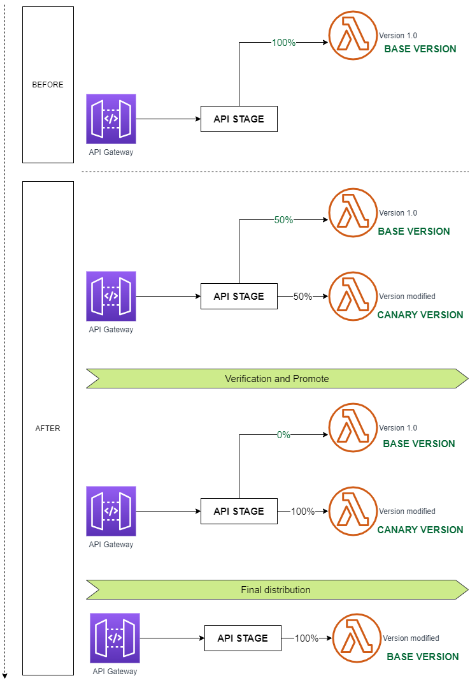

# Hands-on Description
- Create a Base Lambda Function (canary-lambda-base).
- Create a Modified Lambda Function (canary-lambda-modified).
- Create an API CanaryTest with a GET Method (API Gateway).
    - Deploy API in Stage (DEVEL)
    - Create a canary
    - Test the Canary
    - Promote Canary, 100% of traffic only goes throught modified version (canary-lambda-modified).

## Notes
- [Canary Release](https://martinfowler.com/bliki/CanaryRelease.html)
- [Deployment Strategies: Blue-Green, Canary, And More](https://harness.io/blog/blue-green-canary-deployment-strategies/)