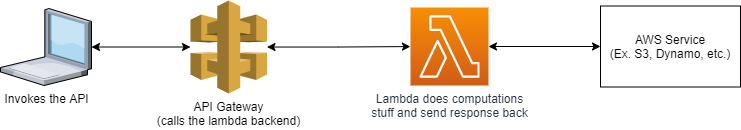

# Hands-on Description
- Playing around and create a simple GET demo API in API Gateway.
- Integrate Lambda as the backend of the API (with Python).
- Test the API in API Gateway Console.
- Deploy the API in a Stage (DEVEL).
- Invoking the API from Internet (with browser).

## Notes
[Resource vs Method in Api Gateway AWS](https://stackoverflow.com/questions/66390728/resource-vs-method-in-api-gateway-aws)