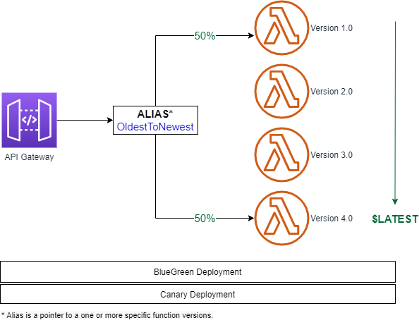

# Hands-on Description
- Create four versions of a Lambda function.
- Create an alias OldestToNewest pointing versions 1 and 4.
    - Shifting traffic between oldest and newest versions, weigthed 50% and 50%.
## API Traffic Splitting using Lambda Versions and Alias
- Create an API AliasTest in API Gateway.
- Create a GET Method with Lambda funtion
- Point API Gateway set to specific Lambda alias
	- ```MyLambdaFunctionName:${stageVariables.lambdaAlias}```
- Add permisions to Lambda Function with AWS Cli.
- Deploy the API in a Stage (DEVEL).
- Setup the Stage Variable lambdaAlias to  value OldestNewest in Stage Editor
- Invoking the API from Internet (with incognito browser).



## Notes
- [How to point API Gateway to a specific Lambda alias](https://stackoverflow.com/questions/35472724/how-to-point-apigateway-to-a-specific-lambda-alias)
- [Deployment Strategies: Blue-Green, Canary, And More](https://harness.io/blog/blue-green-canary-deployment-strategies/)